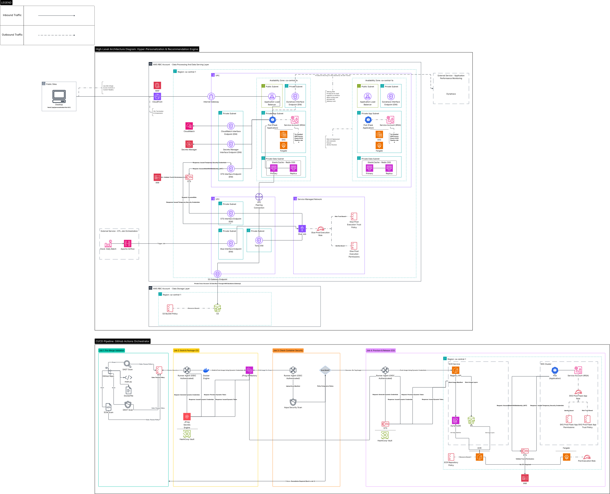

### Hyper-Personalization & Recommendation Engine

**Project Overview:** End-to-end data pipeline leveraging AWS Glue (PySpark) and Apache Airflow for daily batch processing, serving 14M users via TypeScript APIs and Amazon ElastiCache (Redis OSS) for sub-millisecond delivery. Features deep-tier observability via Dynatrace and high-availability container orchestration on AWS ECS/Fargate. Optimized for cross-account security and proactive bottleneck identification.

  
   
  <em>(Click image to open high-resolution SVG for infinite zoom)</em>

---

### 📂 Technical Assets
For offline viewing or specific zoom requirements, choose a format below:

* **[Scalable Vector (SVG)](hyper-personalization-recommendation-engine.svg)** - Recommended for mobile & browser zooming.
* **[High-Resolution Image (PNG)](hyper-personalization-recommendation-engine.png)** - 300 DPI static render.
* **[Document Version (PDF)](hyper-personalization-recommendation-engine.pdf)** - Best for printing or architectural review.
* **[Download Technical Spec](./hyper-personalization-recommendation-engine.pdf)** 
