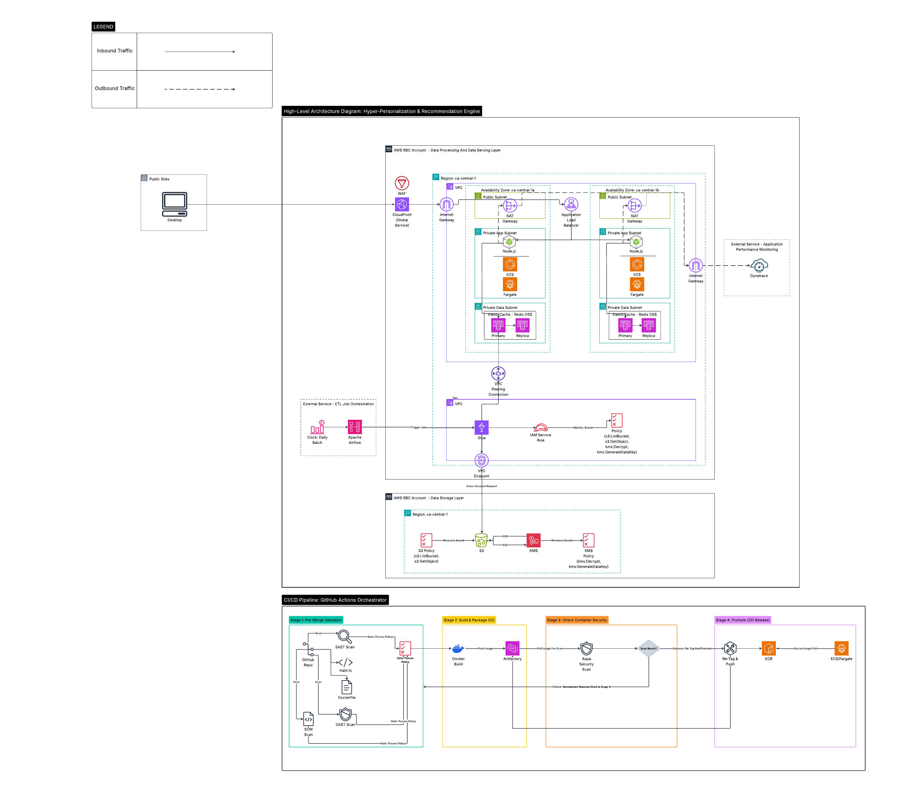

### 1. Hyper-Personalization Engine (Hybrid Data Flow)

**Project Overview:** A secure pipeline serving 14M users, demonstrating the ingestion of sensitive client data from dedicated sources into a high-performance AWS processing environment.
* **View Project:** 

## 🔍 Viewing Options
* **Mobile/Web:** View the image above.
* **Pro Zoom/Print:** [Open High-Res PDF (Raw)](https://github.com/D-anijel-S-tefanovic/architecture-diagrams/tree/main/hyper-personalization-recommendation-engine/Hyper-Personalization & Recommendation Engine.pdf)
