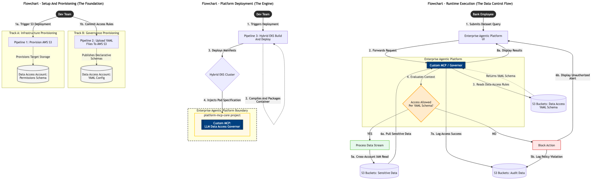
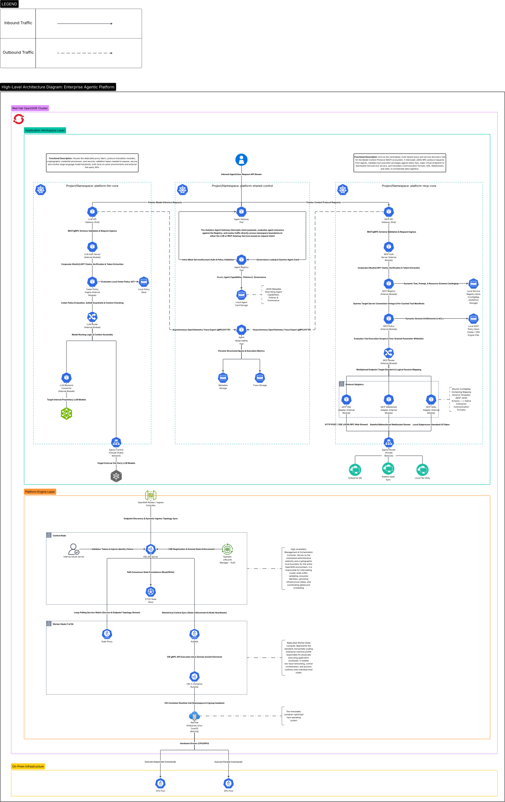
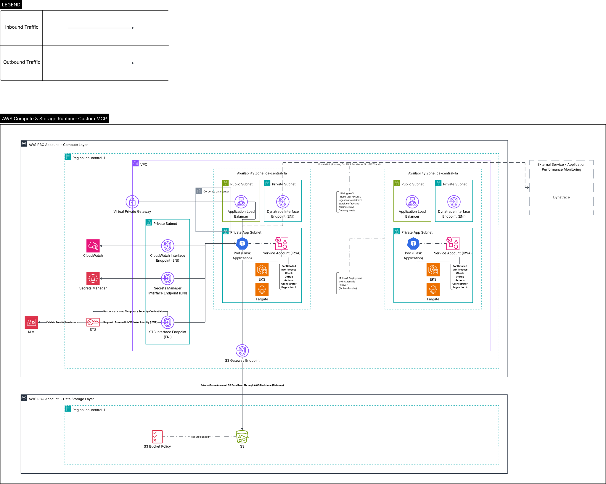
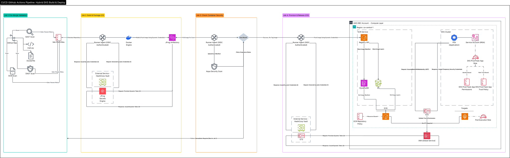
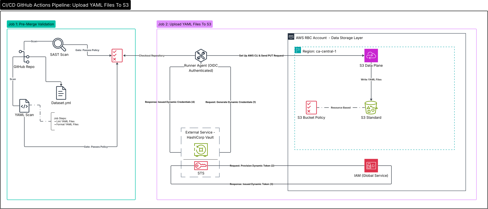
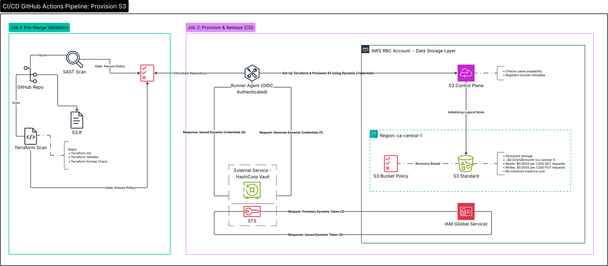

### LLM Data Control Plane - Project Overview

**Problem:** Enterprise LLM workloads lacked precise data segmentation and boundary-enforcement mechanisms, creating severe data-spill risks where conversational models could inadvertently retrieve or surface unauthorized, highly regulated data across multi-tenant user sessions.

**Solution:** 
- Developed a stateless, Python MCP service deployed on AWS EKS/Fargate to maximize horizontal scalability and satisfy strict compliance by eliminating session-level data retention.
- Validated the service via a successful pilot for a 350-person VP organization before embedding it into the core MCP Gateway of an enterprise agentic platform running on Red Hat OpenShift 4, mitigating data sovereignty risks corporation-wide.
- Engineered this cross-platform integration by leveraging native Kubernetes primitives - utilizing custom operators for automated lifecycles, strict namespace isolation, and secure ingress routing - to enforce zero-trust network perimeters and ensure fault-tolerant request handling.
- Designed a data-governance pipeline allowing dataset owners to publish declarative data access schemas via YAML to AWS S3, using OAuth 2.0 authentication to parse user context and dynamically enforce schema-level boundaries across Snowflake, Trino, and HDFS queries.

  
   
  <em>(Click image to open high-resolution Overview Architecture SVG for infinite zoom)</em>

---

### 📂 Technical Assets
For offline viewing or specific zoom requirements, choose a format below:
* **[Scalable Vector (SVG)](svg-images/plane-overview.svg)** - Recommended for mobile & browser zooming.
* **[Document Version (PDF)](llm-data-control-plane.pdf)** - Recommended for printing and sequential reading.

---

### 🔍 Deep-Dive Subsystem Workflows

<b> Click to view High-Level Architecture Diagram 1: Enterprise Agentic Platform</b>

 

<b> Click to view High-Level Architecture Diagram 2: AWS Compute & Storage Runtime - Custom MCP</b>

 

<b> Click to view High-Level Architecture Diagram 3: CI/CD GitHub Actions Pipeline - Hybrid EKS Build & Deploy</b>

 

<b> Click to view High-Level Architecture Diagram 4: CI/CD GitHub Actions Pipeline - Upload YAML Files To S3</b>

 

<b> Click to view High-Level Architecture Diagram 5: CI/CD GitHub Actions Pipeline - Provision S3</b>

 

