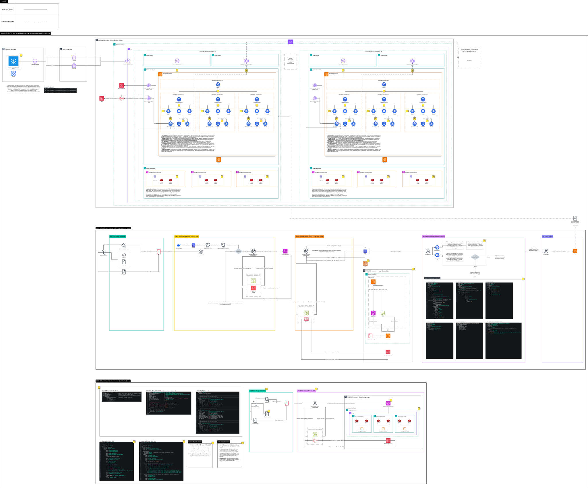

### Platform Modernization Initiative - Project Overview

**Project Statement:** Co-led the strategic migration of core workloads from a legacy CloudFormation-based wrapper to a provider-agnostic Terraform framework. Standardized Infrastructure as Code (IaC) to eliminate configuration drift, ensuring the team's cloud footprint is fully reproducible and aligned with the enterprise hybrid-cloud governance. Piloted the initial transition using microservices in an Nx monorepo, constructing custom GitHub Actions CI/CD pipelines with SonarQube SAST, Snyk SCA, and Aqua Security gates to deploy scalable Kubernetes workloads on Amazon EKS, while incorporating Gremlin chaos testing to validate cluster reliability and post-deployment fault tolerance under load.

  
   
  <em>(Click image to open high-resolution SVG for infinite zoom)</em>

---

### 📂 Technical Assets
For offline viewing or specific zoom requirements, choose a format below:

* **[Scalable Vector (SVG)](platform-modernization-initiative.svg)** - Recommended for mobile & browser zooming.
* **[Document Version (PDF)]("platform-modernization-initiative.pdf)** - Recommended for printing. 
