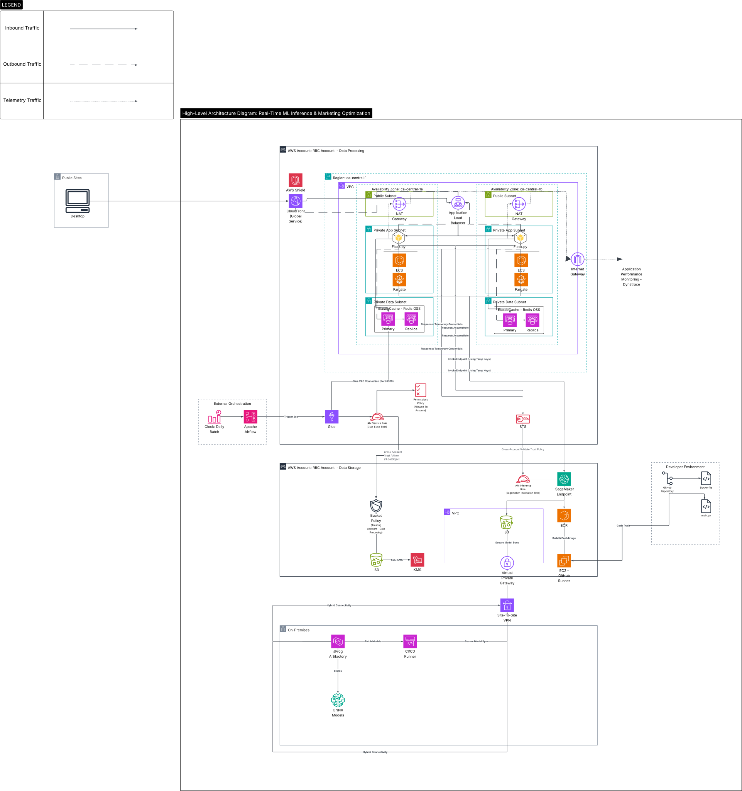

### Real-Time ML Inference & Marketing Optimization

**Project Overview:** A hybrid on-prem-to-cloud data platform utilizing AWS Glue (PySpark) and Apache Airflow for signal ingestion and automated feature engineering. The system facilitates the continuous delivery of low-latency models on Amazon SageMaker, supported by a high-performance serving layer. Data retrieval is optimized through ElastiCache (Redis OSS) for sub-second response times, with all containerized services orchestrated via AWS ECS/Fargate.

  
   
  <em>(Click image to open high-resolution SVG for infinite zoom)</em>

---

### 📂 Technical Assets
For offline viewing or specific zoom requirements, choose a format below:

* **[Scalable Vector (SVG)](real-time-ml-inference-and-marketing-optimization.svg)** - Recommended for mobile & browser zooming.
* **[High-Resolution Image (PNG)](real-time-ml-inference-and-marketing-optimization.png)** - Recommended for 300 DPI static render.
* **[Document Version (PDF)](real-time-ml-inference-and-marketing-optimization.pdf)** - Recommended for printing. 
* **[Download Technical Spec](./real-time-ml-inference-and-marketing-optimization.pdf)** - Recommended architectural review. 
