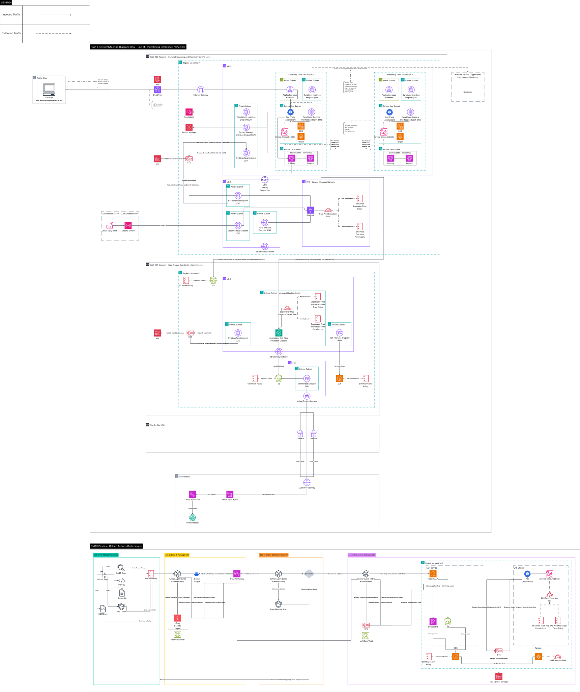

### Real-Time ML Ingestion & Inference Framework - Project Overview

**Problem:** Client-side model execution created training-serving skew due to inconsistent data formats between edge devices and training
pipelines, leading to inaccurate real-time predictions and inefficient marketing ad spend.

**Solution:** 
- Optimized marketing ad spend by 20% through an architected streaming inference system that eliminated training-serving skew via unified signal ingestion and feature engineering.
- Established a hybrid on-prem-to-cloud pipeline using AWS SageMaker to deploy and expose model endpoints.
- Utilized AWS Glue (PySpark) and Apache Airflow for feature engineering and persistent storage in AWS ElastiCache (Redis OSS).
- Engineered for high-throughput elasticity by deploying a Python serving layer via Docker on AWS EKS/Fargate; automated the model-serving infrastructure through a fully-managed CI/CD pipeline to ensure sub-second latency for synchronized feature retrieval and model querying.

  
   
  <em>(Click image to open high-resolution SVG for infinite zoom)</em>

---

### 📂 Technical Assets
For offline viewing or specific zoom requirements, choose a format below:

* **[Scalable Vector (SVG)](real-time-ml-ingestion-inference-framework.svg)** - Recommended for mobile & browser zooming.
* **[Document Version (PDF)](real-time-ml-ingestion-inference-framework.pdf)** - Recommended for printing. 
